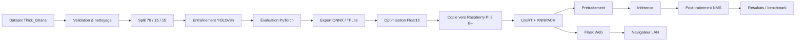
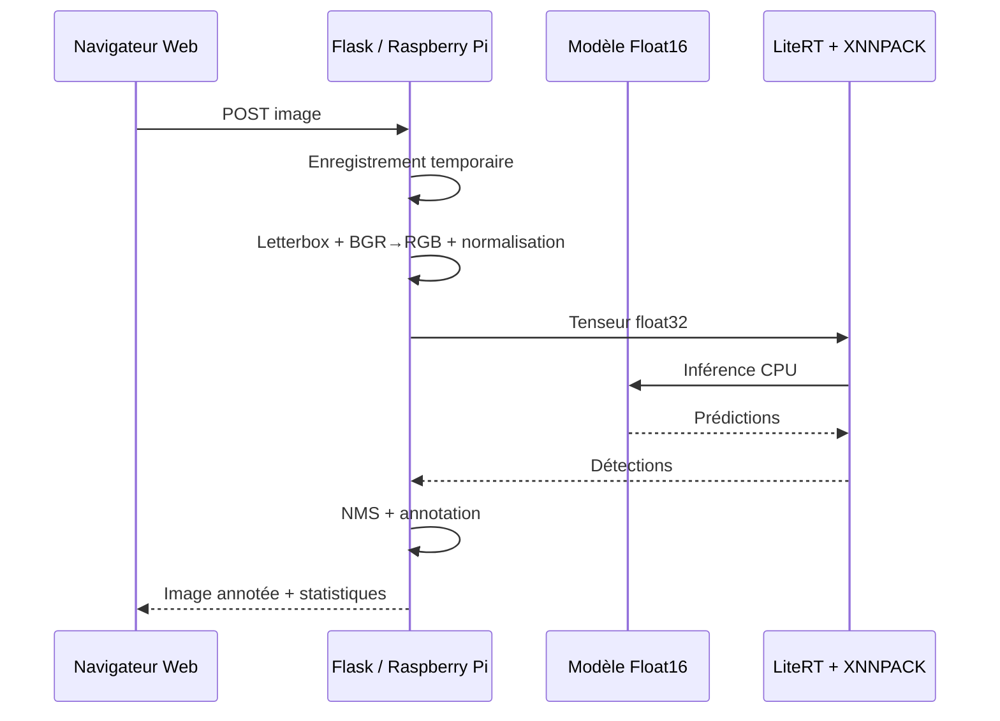

# 🦟 Paludisme Edge AI — YOLOv8n Float16 sur Raspberry Pi 3 B+

[](https://www.python.org/)
[](https://docs.ultralytics.com/)
[](#déploiement-sur-raspberry-pi)
[](#déploiement-sur-raspberry-pi)

Projet académique reproductible consacré à la **détection automatisée des cellules et des parasites du paludisme dans des images de frottis sanguins épais**, depuis l'entraînement sur Kaggle jusqu'à l'inférence locale sur Raspberry Pi 3 B+.

> **Statut : preuve de faisabilité expérimentale.** Ce dépôt ne constitue pas un dispositif médical ou un outil de diagnostic clinique validé.

---

## 1. Vue d'ensemble

Le projet suit la chaîne suivante :



### Objectifs

1. Établir une performance de référence avec YOLOv8n.
2. Comparer les formats et optimisations destinés à l'embarqué.
3. Vérifier la faisabilité d'une inférence locale sur une plateforme Edge à ressources limitées.
4. Mesurer l'effet de la résolution d'entrée sur la latence, le FPS et la RAM.

---

## 2. Configuration expérimentale de référence

| Élément | Configuration |
|---|---|
| Dataset | Lacuna Malaria Dataset — `Thick_Ghana` |
| Images après nettoyage | 3 045 |
| Classes | `0 = cell`, `1 = parasite` |
| Répartition | 2 131 train / 457 validation / 457 test |
| Modèle | YOLOv8n |
| Entraînement | 100 époques |
| Format Edge | TensorFlow Lite Float16 |
| Runtime Edge | LiteRT + XNNPACK |
| Matériel | Raspberry Pi 3 B+ — ARM Cortex-A53, 1 Go RAM |
| Threads | 4 CPU |
| Seuil de confiance | 0,25 |
| IoU NMS | 0,50 |
| Résolution retenue pour l'Edge | 320×320 |

Les poids et les données ne sont **pas** inclus dans Git afin d'éviter de versionner des fichiers volumineux et/ou soumis à des conditions de redistribution. Voir [Données et modèles](#7-données-et-modèles).

---

## 3. Résultats principaux du mémoire

### 3.1 Modèle de référence

| Métrique | Résultat |
|---|---:|
| Précision | 88,90 % |
| Recall | 87,00 % |
| F1-score | 87,94 % |
| mAP@0.5 | 90,51 % |
| mAP@0.5:0.95 | 59,55 % |

Le mAP@0.5 dépasse la cible de 85 %, tandis que le recall reste légèrement inférieur à la cible de 90 %.

### 3.2 Optimisation

| Format | Taille approximative | Observation |
|---|---:|---|
| PyTorch | — | Référence |
| ONNX | — | Performances proches de PyTorch |
| TFLite Float16 | 5,91 MB | Bon compromis performance/taille |
| Dynamic Range | 3,22 MB | Taille réduite, latence plus élevée dans l'essai |
| INT8 | 3,12 MB | Forte dégradation des performances dans la configuration étudiée |

Pour INT8, les valeurs mesurées dans le mémoire sont : précision **40,04 %**, recall **56,97 %**, F1-score **47,03 %**, mAP@0.5 **41,82 %**.

### 3.3 Benchmark Edge multi-résolutions

| Résolution | Total moyen | FPS moyen | RAM moyenne |
|---|---:|---:|---:|
| 320×320 | 168,56 ms | **5,95** | 134,6 MB |
| 416×416 | 291,69 ms | 3,43 | 157,2 MB |
| 512×512 | 597,80 ms | 1,67 | 168,45 MB |
| 640×640 | 928,96 ms | 1,08 | 193,70 MB |
| 800×800 | 1 791,56 ms | 0,58 | 245,14 MB |
| 960×960 | 2 216,57 ms | 0,45 | 278,04 MB |

La résolution **320×320** a été retenue pour les expérimentations Edge car elle fournit le meilleur débit et la plus faible consommation mémoire parmi les configurations testées.

> Les tableaux ci-dessus reproduisent les résultats documentés dans le mémoire. Les scripts du dépôt permettent de **recalculer** les mesures sur les fichiers effectivement fournis à l'utilisateur.

---

## 4. Arborescence du dépôt

```text
paludisme-edge-ai/
├── README.md
├── CITATION.cff
├── LICENSE
├── requirements-train.txt
├── requirements-edge.txt
├── .gitignore
│
├── configs/
│   ├── data.yaml.example
│   ├── reproducibility.json
│   └── benchmark_resolutions.json
│
├── data/
│   └── README.md
│
├── models/
│   └── README.md
│
├── src/
│   ├── inference.py
│   ├── preprocess.py
│   ├── postprocess.py
│   └── benchmark.py
│
├── scripts/
│   ├── validate_dataset.py
│   ├── prepare_dataset.py
│   ├── train.py
│   ├── evaluate.py
│   ├── export_tflite.py
│   ├── check_model.py
│   ├── system_info.py
│   └── benchmark_edge.py
│
├── web/
│   ├── app.py
│   ├── templates/index.html
│   └── static/style.css
│
├── docs/
│   ├── reproduction.md
│   ├── architecture.md
│   ├── results.md
│   ├── troubleshooting.md
│   └── assets/architecture.svg
│
└── results/
    └── README.md
```

---

## 5. Reproduire l'entraînement sur Kaggle

### 5.1 Préparer l'environnement

Dans un notebook Kaggle :

```bash
pip install -r requirements-train.txt
```

Ou, si le dépôt est cloné :

```bash
git clone <URL_DU_DEPOT>
cd paludisme-edge-ai
pip install -r requirements-train.txt
```

### 5.2 Préparer le dataset

Le dépôt ne redistribue pas le Lacuna Malaria Dataset. Après avoir ajouté le dataset dans Kaggle, identifier :

- le dossier contenant les images Thick_Ghana ;
- le dossier contenant les annotations YOLO ;
- les images et annotations portant le même nom de base.

Valider d'abord :

```bash
python scripts/validate_dataset.py \
  --images /kaggle/input/.../Thick_Ghana/Ghana/Thick \
  --labels /kaggle/input/.../Thick_Ghana/Ghana/Thick/labels_yolo
```

Puis construire le dataset YOLO :

```bash
python scripts/prepare_dataset.py \
  --images /kaggle/input/.../Thick_Ghana/Ghana/Thick \
  --labels /kaggle/input/.../Thick_Ghana/Ghana/Thick/labels_yolo \
  --output /kaggle/working/dataset \
  --train 0.70 \
  --val 0.15 \
  --test 0.15 \
  --seed 42
```

Le script produit :

```text
/kaggle/working/dataset/
├── train/images
├── train/labels
├── valid/images
├── valid/labels
├── test/images
├── test/labels
└── data.yaml
```

### 5.3 Entraîner YOLOv8n

```bash
python scripts/train.py \
  --data /kaggle/working/dataset/data.yaml \
  --epochs 100 \
  --imgsz 320 \
  --project runs/detect \
  --name paludisme_yolov8n
```

Le meilleur poids est généralement :

```text
runs/detect/paludisme_yolov8n/weights/best.pt
```

### 5.4 Évaluer

```bash
python scripts/evaluate.py \
  --weights runs/detect/paludisme_yolov8n/weights/best.pt \
  --data /kaggle/working/dataset/data.yaml \
  --imgsz 320 \
  --split test
```

### 5.5 Exporter en TFLite Float16

```bash
python scripts/export_tflite.py \
  --weights runs/detect/paludisme_yolov8n/weights/best.pt \
  --imgsz 320 \
  --half
```

Récupérer le fichier TFLite généré puis, si nécessaire, le renommer selon la convention du projet :

```text
best_float16_320.tflite
```

Pour les autres résolutions, répéter avec `416`, `512`, `640`, `800` et `960`.

---

## 6. Déployer sur le Raspberry Pi 3 B+

### 6.1 Se connecter

Depuis Windows PowerShell :

```powershell
ssh lionel@raspberrypi.local
```

Puis :

```bash
cd ~/paludisme
source venv/bin/activate
```

### 6.2 Créer l'environnement

```bash
mkdir -p ~/paludisme/{model,images,results,src}
cd ~/paludisme
python3 -m venv venv
source venv/bin/activate
```

Installer uniquement les dépendances Edge :

```bash
pip install -r requirements-edge.txt
```

Vérifier LiteRT et psutil :

```bash
python3 -c "import ai_edge_litert; print('LiteRT:', ai_edge_litert.__version__)"
python3 -c "import psutil; print('psutil OK')"
```

### 6.3 Copier le modèle

Depuis le PC, exemple avec SCP :

```powershell
scp .\best_float16_320.tflite lionel@raspberrypi.local:/home/lionel/paludisme/model/320/
```

Sur le Raspberry Pi :

```bash
mkdir -p ~/paludisme/model/320
ls -lh ~/paludisme/model/320/best_float16_320.tflite
```

### 6.4 Vérifier le modèle

```bash
python scripts/check_model.py \
  --model ~/paludisme/model/320/best_float16_320.tflite \
  --size 320
```

Pour un modèle 800×800 :

```bash
python scripts/check_model.py \
  --model ~/paludisme/model/800/best_float16_800.tflite \
  --size 800
```

Le modèle 800×800 utilisé dans les essais du projet présente notamment une entrée `[1, 800, 800, 3]` et une sortie `[1, 6, 13125]`.

---

## 7. Benchmark Edge

### 7.1 Placer les images

```bash
mkdir -p ~/paludisme/images
ls ~/paludisme/images/*.jpg | wc -l
```

Dans le benchmark du mémoire, **62 images** ont été utilisées pour les essais Edge multi-résolutions.

### 7.2 Benchmark 320×320

```bash
python scripts/benchmark_edge.py \
  --model ~/paludisme/model/320/best_float16_320.tflite \
  --images ~/paludisme/images \
  --output ~/paludisme/results/benchmark_320 \
  --imgsz 320 \
  --threads 4 \
  --conf 0.25 \
  --iou 0.50
```

Le benchmark génère notamment :

```text
benchmark_320/
├── per_image.csv
└── benchmark_summary.csv
```

Les indicateurs produits sont :

- Images testées
- Cellules moyennes
- Parasites moyens
- Parasitémie moyenne
- Confiance parasites moyenne
- Confiance globale moyenne
- Prétraitement moyen
- Inférence moyenne
- Post-traitement moyen
- Temps total moyen
- Médiane du temps total
- Minimum
- Maximum
- Écart-type
- FPS moyen
- RAM moyenne

### 7.3 Tester toutes les résolutions

```bash
for s in 320 416 512 640 800 960; do
  python scripts/benchmark_edge.py \
    --model ~/paludisme/model/$s/best_float16_$s.tflite \
    --images ~/paludisme/images \
    --output ~/paludisme/results/benchmark_$s \
    --imgsz $s \
    --threads 4 \
    --conf 0.25 \
    --iou 0.50
done
```

> Les mesures documentées dans le mémoire ont été réalisées dans des conditions contrôlées. Les résultats peuvent varier légèrement selon la température du Pi, les processus en arrière-plan, la version du runtime et l'état du système.

---

## 8. Inférence sur une seule image

```bash
python -m src.inference \
  --model ~/paludisme/model/320/best_float16_320.tflite \
  --image ~/paludisme/images/image.jpg \
  --output ~/paludisme/results/image_annotated.jpg \
  --imgsz 320 \
  --threads 4 \
  --conf 0.25 \
  --iou 0.50
```

Le programme affiche le nombre de cellules, le nombre de parasites, la parasitémie estimée, la confiance moyenne des parasites et le temps d'inférence.

---

## 9. Interface Web Flask

Copier le modèle retenu dans :

```text
models/best_float16_320.tflite
```

Puis lancer :

```bash
python web/app.py
```

Depuis un ordinateur connecté au même réseau local, ouvrir :

```text
http://raspberrypi.local:5000
```

Architecture :



---

## 10. Transfert Kaggle → Raspberry Pi

Le flux recommandé est :

```text
Kaggle
  │
  ├── entraînement YOLOv8n
  ├── best.pt
  ├── export TFLite Float16
  │
  ▼
PC Windows
  │
  └── SCP
  ▼
Raspberry Pi 3 B+
  │
  ├── model/
  ├── images/
  ├── results/
  └── web/
```

Exemple :

```powershell
scp .\best_float16_320.tflite lionel@raspberrypi.local:/home/lionel/paludisme/model/320/
scp -r .\src lionel@raspberrypi.local:/home/lionel/paludisme/
scp -r .\web lionel@raspberrypi.local:/home/lionel/paludisme/
```

---

## 11. GitHub : publier le projet

Après avoir vérifié le dépôt local :

```bash
git init
git add .
git status
git commit -m "Initial release: malaria detection Edge AI"
git branch -M main
git remote add origin https://github.com/<USERNAME>/<REPOSITORY>.git
git push -u origin main
```

Pour une mise à jour :

```bash
git add .
git commit -m "Update benchmark and documentation"
git push
```

### Avant le premier `git push`

Vérifier que les fichiers volumineux ou sensibles ne sont pas suivis :

```bash
git status
```

Le `.gitignore` exclut notamment :

```text
*.pt
*.onnx
*.tflite
data/raw/
venv/
runs/
results/web_uploads/
```

Si un modèle a déjà été ajouté par erreur :

```bash
git rm --cached path/to/model.tflite
git commit -m "Remove generated model from Git tracking"
```

---

## 12. Reproductibilité scientifique

Pour reproduire les résultats, conserver simultanément :

1. la version du dataset ;
2. le split train/validation/test ;
3. la graine aléatoire ;
4. les poids `best.pt` ;
5. la version Ultralytics ;
6. la version Python ;
7. le modèle TFLite exact ;
8. la résolution d'entrée ;
9. le nombre de threads ;
10. les seuils de confiance et IoU ;
11. la version LiteRT ;
12. la configuration matérielle du Raspberry Pi.

La configuration de référence est également enregistrée dans `configs/reproducibility.json`.

---

## 13. Limites

- Le dataset présente un déséquilibre important entre `cell` et `parasite`.
- Les conditions d'acquisition ne couvrent pas nécessairement tous les microscopes et laboratoires.
- Les essais ne constituent pas une validation clinique.
- Le Raspberry Pi 3 B+ reste limité en calcul pour les grandes résolutions.
- La consommation énergétique n'a pas été caractérisée de façon exhaustive.

---

## 14. Perspectives

Les principales pistes sont l'amélioration de la généralisation sur des données locales et multicentriques, l'amélioration de la localisation des parasites, l'étude de plateformes Edge plus puissantes et l'évaluation clinique et énergétique du système.

---

## 15. Citation

Si vous utilisez ce dépôt dans un travail académique, veuillez citer le mémoire et conserver la configuration expérimentale utilisée.

Voir également `CITATION.cff`.

---

## 16. Licence et usage

Le code est fourni sous licence MIT. Les données du Lacuna Malaria Dataset et les modèles pré-entraînés/exportés restent soumis à leurs propres conditions d'utilisation et de redistribution.

**Important :** ce projet est destiné à la recherche et à la démonstration technique. Il ne doit pas être utilisé seul pour établir un diagnostic médical.
